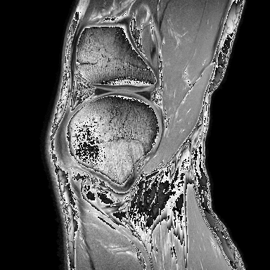
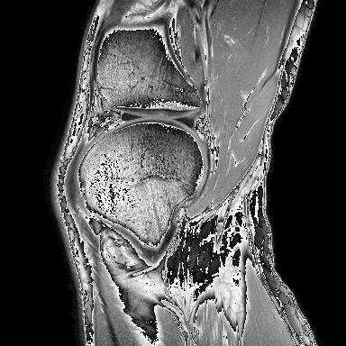
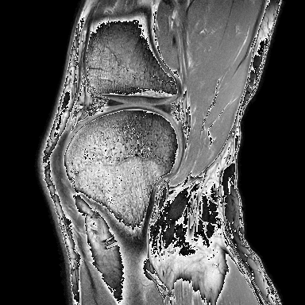
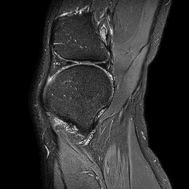

# MRI_contrast_conversion

Create STIR Image from t1, t2, gre MRI image

Models
- Unet
- Attention Unet (using 3 type images at once)
- Splited Attention Unet (using 3 type images seperatly)

[t1 image]

[t2 image]

[gre image]

[stir image]

